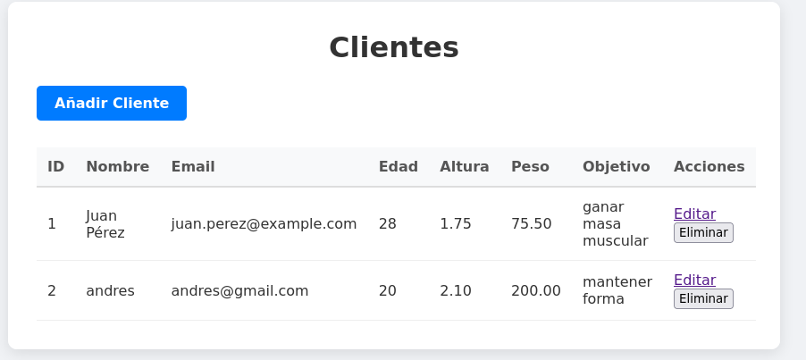
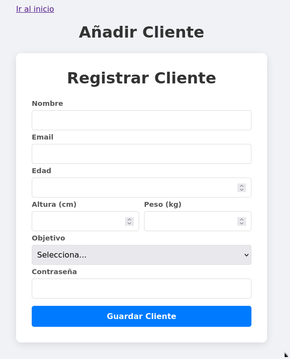
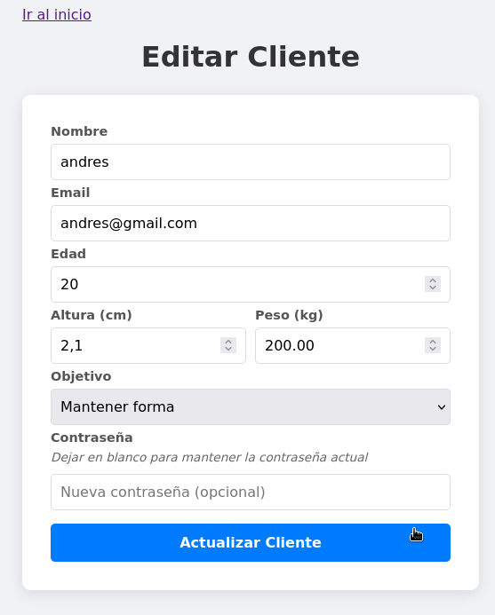
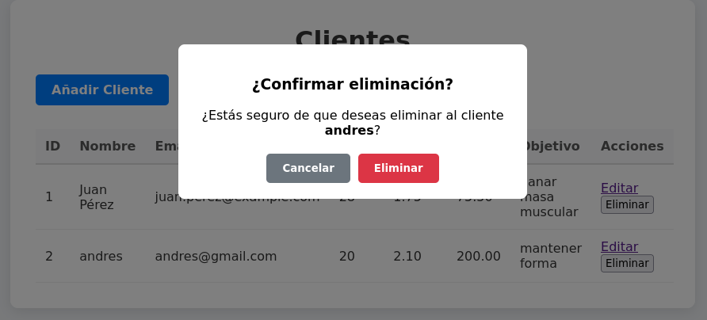

# Aplicación CRUD con Laravel sobre entidad clientes- Maquinistas

## Finalidad de la aplicación
 
La aplicación implementa un CRUD completo que permite **crear, listar, editar y eliminar** clientes de forma sencilla mediante una interfaz web intuitiva.


**Comandos Artisan utilizados**

Hemos usado comandos básicos para crear modelos y hacer migraciones sobre bbdd.

**Crear el modelo y la migración para la tabla clients**

 make art cmd="make:model Client -m"

**Ejecutar las migraciones para crear las tablas en la base de datos**

  Usamos el comando make art cmd="migrate"

**Organización del proyecto**

## Modelo (Client.php)

 El modelo `Client` se encuentra en `app/Models/Client.php` y representa la entidad Cliente en la base de datos.

Aquí se define el array `$fillable` con los campos rellenables

(nombre, email, edad, altura, peso, objetivo, password)


## Controlador (ClientController.php)
El controlador `ClientController` está ubicado en `app/Http/Controllers/ClientController.php` y gestiona toda la lógica del CRUD.

**Métodos implementados:**

- **`index()`**: Obtiene todos los clientes mediante `Client::all()` y los envía a la vista `index.blade.php` para mostrarlos en una tabla.

- **`create()`**: Muestra el formulario para crear un nuevo cliente cargando la vista `create.blade.php`.

- **`store()`**: Valida los datos del formulario y crea un nuevo cliente en la base de datos. La contraseña se encripta con `bcrypt()` antes de guardarla. Finalmente redirige al listado.

- **`edit($id)`**: Busca el cliente por su ID mediante `findOrFail()` y carga la vista `update.blade.php` con los datos actuales del cliente.

- **`update($id)`**: Valida los datos del formulario de edición y actualiza el cliente en la base de datos. La contraseña solo se actualiza si se proporciona una nueva. Redirige al listado después de actualizar.

- **`destroy($id)`**: Elimina el cliente de la base de datos mediante `delete()` y redirige al listado.

### **Rutas (web.php)**
En el archivo `routes/web.php` se ha definido la ruta de recursos que genera automáticamente todas las rutas necesarias para el CRUD:

```php
Route::resource('clients', ClientController::class);
```

Esto crea las siguientes rutas:
- `GET /clients` → index (listar)
- `GET /clients/create` → create (formulario crear)
- `POST /clients` → store (guardar)
- `GET /clients/{id}/edit` → edit (formulario editar)
- `PUT /clients/{id}` → update (actualizar)
- `DELETE /clients/{id}` → destroy (eliminar)


## **Vistas**
Las vistas están organizadas en `resources/views/clients/` y utilizan Blade como motor de plantillas.

**`layout.blade.php`**: Plantilla principal que define la estructura base de la aplicación. Las demás vistas extienden de esta mediante `@extends('layout')`.

**`index.blade.php`**: 
Muestra el listado de todos los clientes en una tabla con sus datos. 
Incluye un botón para añadir nuevos clientes y columnas con acciones para editar y eliminar cada cliente.

**`create.blade.php`**: 
Vista que muestra el formulario para crear un nuevo cliente.
Incluye el parcial `_form.blade.php` que contiene el formulario completo con todos los campos.

**`_form.blade.php`**: 
Formulario parcial reutilizable que contiene todos los campos necesarios para crear un cliente:
Nombre, email, edad, altura, peso, objetivo y contraseña.

**`update.blade.php`**: 
Vista que muestra el formulario para editar un cliente existente.
Incluye el parcial `_formupdate.blade.php` y usa `@method('PUT')` para indicar que es una actualización.
Envía los datos a la ruta `clients.update`.

**`_formupdate.blade.php`**: 
Formulario parcial para edición que es similar a `_form.blade.php`, pero:
Pre-carga los datos actuales del cliente usando `old('campo', $client->campo)`.
La contraseña es opcional: si se deja en blanco, se mantiene la contraseña actual.
Incluye un texto informativo indicando que la contraseña es opcional.

## Funcionamiento de la aplicación

La aplicación muestra un listado de clientes en la página principal (`index.blade.php`).
Cada cliente se muestra en una fila con sus datos personales y una columna de acciones con dos botones de editar y eliminar.

**Crear un cliente:**
Al hacer clic en "Añadir Cliente", se carga el formulario de creación donde se introducen todos los datos.
Los datos se validan en el controlador mediante `$request->validate()` y, si son correctos, se guarda el nuevo.

**Editar un cliente:**
Al hacer clic en "Editar", se carga el formulario de edición con los datos actuales del cliente ya pre-cargados.

**Eliminar un cliente:**
Al hacer clic en "Eliminar", aparece un modal de confirmación que muestra el nombre del cliente.
Si se confirma, se envía un formulario con el método DELETE que ejecuta `$client->delete()` en el controlador.

## Capturas de pantalla

### Listado de clientes


### Crear cliente


### Editar cliente


### Modal de confirmación para eliminar

